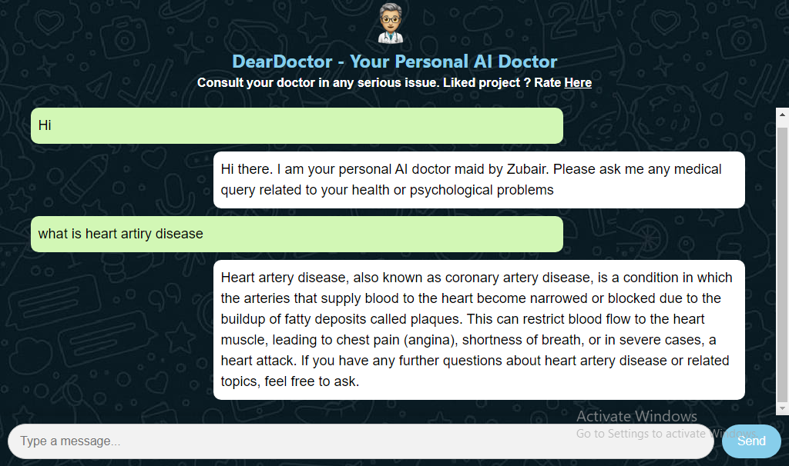
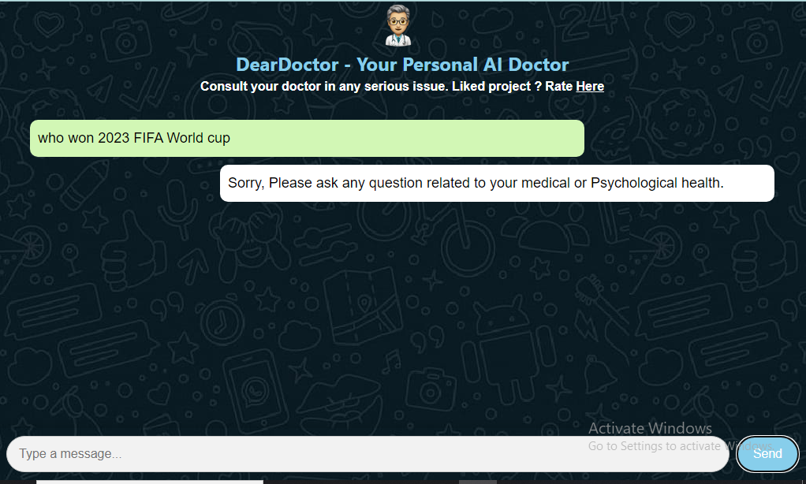

# DearDoctor - Your Personal AI Doctor
DearDoctor is a HTML5, CSS3 and JS web-based AI chatbot designed to provide medical advice and assistance. It utilizes cutting-edge AI technology to respond to user queries related to medical conditions, diseases, treatments, and general health inquiries. [Try here](https://zubairjammu786.github.io/deardoctor)

*please note that our api can only send 300 messags per day so please don't steal it. Its been here for demo and testing only*


## Features
- **Personalized Medical Assistance**: Consult your personal AI doctor for medical advice and assistance.
- **Responsive Design**: User-friendly interface accessible on various devices.
- **Secure Communication**: Your privacy and confidentiality are ensured through secure communication channels.
- **Advanced AI Technology**: Powered by GPT-3.5-Turbo-16k models for accurate and relevant responses.

## Screenshots

### Main Chat Interface


### Example Conversation


### Restricted to only Medical Chat


## Usage

1. Obtain your OpenAI key from `https://openai.com/blog/openai-api`
2. Replace your OpenAI key in the functionality.js
```bash
Authorization": "Bearer YOUR_OPENAI_KEY"
``` 
3. To clone this repository to your local machine, use the following command:
```bash
git clone https://github.com/zubairjammu786/deardoctor.git
```
4. Change the directory to
```bash
cd deardoctor
```
5. run the file
```bash
deardoctor.html
```

## Contributing
Contributions are welcome! If you have suggestions, feature requests, or would like to report a bug, please open an issue or submit a pull request.

## License
This project is licensed under the [MIT License](LICENSE).
