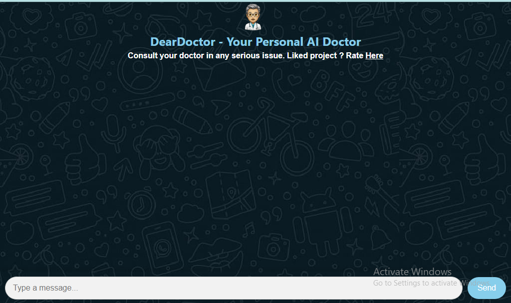
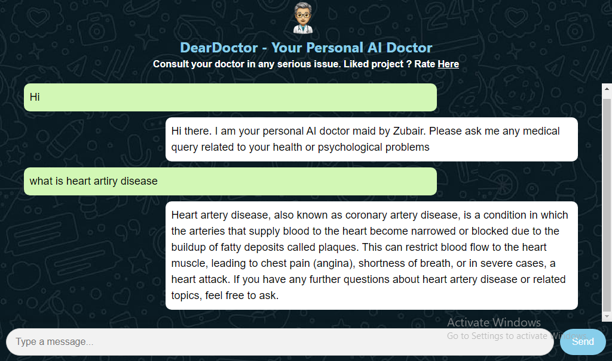
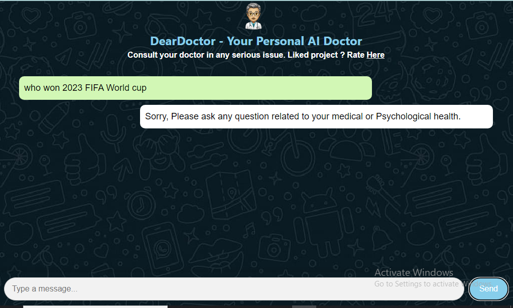

# DearDoctor - Your Personal AI Doctor
DearDoctor is a web-based AI chatbot designed to provide medical advice and assistance. It utilizes cutting-edge AI technology to respond to user queries related to medical conditions, diseases, treatments, and general health inquiries.

## Features
- **Personalized Medical Assistance**: Consult your personal AI doctor for medical advice and assistance.
- **Responsive Design**: User-friendly interface accessible on various devices.
- **Secure Communication**: Your privacy and confidentiality are ensured through secure communication channels.
- **Advanced AI Technology**: Powered by state-of-the-art AI models for accurate and relevant responses.

## Screenshots

### Main Chat Interface

### Example Conversation

### Privacy and Disclaimer

## Usage
To use DearDoctor, simply visit the website and start typing your medical inquiries. The AI chatbot will provide prompt and informative responses to assist you with your health concerns.

## Contributing
Contributions are welcome! If you have suggestions, feature requests, or would like to report a bug, please open an issue or submit a pull request.

## License
This project is licensed under the [MIT License](LICENSE).
